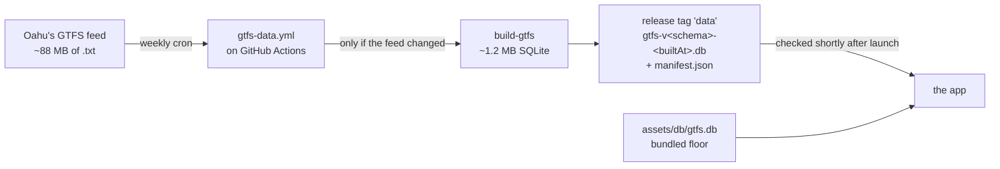

# Where Da Bus

An unofficial real-time bus tracking app for Oahu, replacing the recently deprecated Da Bus app. Built with [Expo](https://expo.dev) and [React Native](https://reactnative.dev), on [TheBus](https://www.thebus.org)' public [Web Services API](https://api.thebus.org).

## Purpose

This is a personal project that serves a few of my own interests:
- Replace the old Da Bus app with a new version catered to my own UI/UX preferences.
- Pick up Expo and React Native, which I've been meaning to do for a while.
- Learn ~~vibe-coding~~, er, I mean, *agentic engineering* with Claude Code.
  - I don't believe one should use AI to entirely replace coding, but I *do* believe that it is possible to do real engineering work with AI, and that it takes real skill to do so. I do not claim to understand every line of code in this project, though I have personally overseen every major architectural/design decision and tried to make each one as informed as I could.

I will not be officially publishing this app, but if you would like to build it for yourself, [register for an API key](https://api.thebus.org/NewAccount/), build the application, and sideload it using a sideloader like [SideStore](https://sidestore.io). Keep in mind I built this project with a minimum iOS version of 18 in mind (this is the last iOS my iPhone XR supports).

### Sideloading

These are basic instructions for how I've been sideloading it on my phone with a Windows machine. More details about the process are in [docs/sideloading.md](docs/sideloading.md), and SideStore's own [installation guide](https://docs.sidestore.io/docs/installation/install) is the authority whenever the two disagree.

#### Setup
1. Get an api key from [api.thebus.org](https://api.thebus.org/NewAccount/).
1. Install and setup [SideStore](https://sidestore.io) on your phone. Roughly, the instructions are:
    - Install [iloader](https://github.com/nab138/iloader) on your computer.
    - Turn on developer mode on your phone.
    - Install and turn on LocalDevVPN on your phone.
    - Use iloader to install the SideStore app on your phone.
1. Install Itunes and connect your phone.

#### Installing the .ipa
1. Get the .ipa file on your phone. There are a few ways to do this, but the easiest I've found is:
    - Itunes &rarr; File Sharing &rarr; SideStore &rarr; drag and drop the .ipa &rarr; link and sync.
1. Make sure LocalDevVPN is turned on, as well as developer mode.
1. Install the .ipa with SideStore on your phone.
1. Launch the app, paste your key, and you're in!
1. Resign the app (and SideStore) every 7 days. You don't need the computer to do this, only need LocalDevVPN on.

## Features

- **A map of the stops around you**, which is the home screen. Tap anywhere on the island to see what's running there, so you can check service somewhere unfamiliar before you leave the house.
- **Stops near you**, sorted by distance. This is the whole reason the app exists — Google Maps won't show you anything until you give it a destination, and Apple Maps is too shallow to be useful at a stop.
- **Search** across stop names, the number printed on the physical stop sign, route numbers, and Oahu addresses — one box, and it works out which kind of answer you meant.
- **Favorites**, for the stops you actually use.
- **Live arrivals** for any stop, in one chronological list sectioned by direction, the way Da Bus did it.
- **An honest distinction between a real GPS estimate and a schedule guess.** Roughly 96% of what the API returns is the latter, and labelling those as live times is how a transit app earns your distrust at a stop at night.
- **Routes drawn on the map.** Pick a route and the map draws the road it actually follows, that route's stops as its pins, and the buses driving it right now — each labelled with its fleet number and how long ago it reported. One direction at a time, and the map stays in route mode until you close it.
- **Route detail** — every stop a route serves, in order, entirely offline.
- **Light, dark and automatic theming.**
- **Stop data that keeps itself current.** A copy ships with the app as a floor, and a fresher one is fetched in the background when the published feed changes, so the data doesn't go stale between builds.
- **Error states that tell you the truth.** "No buses coming" and "couldn't reach the API" never look alike, and a spinner never replaces times you already had. It shows you the stale ones with an age instead.

## Architecture

**Two data sources, and the split between them is the load-bearing decision.** Anything time-sensitive — arrival times, where the buses are — comes from the live API on every view. Everything static — stop names, the codes on the signs, coordinates, route shapes, which routes serve which stop — comes from a [GTFS](https://gtfs.org) feed baked into a SQLite file. Oahu's feed is not fresh enough to be trusted for arrival times, so it is never asked about them.

That means the app is useful with no network at all: the map draws, the stops are there, and a route's stop list reads fine offline. Only the times go missing, and the UI says so rather than showing a spinner forever.

```
app/                 every file is a route (expo-router) — three lines each
features/            the actual screens: map, stops, arrivals, routes, search, settings
data/thebus/         TheBusClient — the only thing that touches the live API
data/gtfs/           the SQL, and the hooks that open the database
scripts/build-gtfs/  the feed -> assets/db/gtfs.db
```

Three boundaries carry the weight. **`TheBusClient` is an interface**, because the vendor's JSON is string-typed throughout, disagrees with its own field tables, and uses `"0"` and `"???"` as sentinels — that mapping is real work and it belongs in one place rather than in a screen. **The API key belongs to the user**, lives in the device keychain, and gates the whole app: no key, no screens, so "no key yet" never becomes a state every data view has to render. And **error states are a feature** — loading, data-with-an-age, and error-with-last-known-values are three different things, because "no buses coming" and "couldn't reach the API" must never look alike at a stop at night.

### The database builds itself

Nobody runs the build script by hand, and the `.db` in the repo is not the one you end up using.



`.github/workflows/gtfs-data.yml` runs Mondays, downloads the feed, and **exits without publishing if it hasn't changed**. When it has, the build script reads it — including the 73 MB `stop_times.txt` — and emits about 1.2 MB holding only the relationships those files imply. No `.txt` ever ships, and `stop_times.txt` in particular is deliberately never an asset: it is tens of megabytes answering a question the live arrivals endpoint already answers.

The app checks `manifest.json` shortly after launch, **verifies the `sha256` and counts the rows in the download before trusting it**, and then moves a stored pointer — it does not swap the database underneath a running screen. The build you download now is the one you open next launch.

`assets/db/gtfs.db` stays committed and bundled as a **floor**. That is what makes every failure in the chain — no network, a bad hash, a truncated download, a release that never got published — degrade to *stale data* rather than to *no data*. The schema version is part of the published filename, so an old build is never handed a database it cannot read.

The feed also states the last day it is valid through; the build carries that into the file, and Settings says so once that day has passed.

## Development

Two test runners, deliberately. Jest covers everything that imports React Native; the GTFS build script and the SQL are plain Node and run under `node --test` against the real built asset, with no React Native in the program at all. A change to the database layer needs both.

```bash
npm start              # Expo dev server — scan the QR with Expo Go. The normal dev loop.
npm test               # Jest: everything that imports React Native
npm run test:scripts   # node --test: the GTFS build script and the SQL
npm run typecheck      # tsc --noEmit
npm run build:gtfs     # Rebuild assets/db/gtfs.db from the published feed
```

You don't need anything in `.env`. The app asks for an API key on first launch and keeps it in the device keychain — register a free one at <https://api.thebus.org/NewAccount/>. It used to read the key from `EXPO_PUBLIC_THEBUS_APP_ID`, which meant the key was baked into every build and extractable from the `.ipa`; each install now brings its own, so the quota isn't shared and there's nothing in the binary to extract.

The Expo SDK is pinned to [54](https://docs.expo.dev/versions/v54.0.0/) on purpose. [Expo Go](https://expo.dev/go) on iOS 18 doesn't support anything newer, and Expo Go is the fast iteration loop, so install packages with `npx expo install` rather than plain `npm install`.

I develop on Windows with no Mac, so iOS builds happen on a [GitHub Actions](.github/workflows/ios-ipa.yml) macOS runner and come out unsigned. Signing is done on-device by [SideStore](https://sidestore.io) with a free Apple ID. [docs/sideloading.md](docs/sideloading.md) walks through getting a build onto a phone; the rest of `docs/` covers [the API](docs/api/README.md), [the design](docs/superpowers/specs/2026-07-29-wheredabus-design.md), and [the known defects](docs/backlog.md) I've decided not to fix yet.

## License

The source code is MIT licensed — see [LICENSE](LICENSE). Do what you like with it.

The transit data is a different matter, and its terms are not mine to relax. Route and arrival data is used by permission of Oahu Transit Services, under a limited licence they can **revoke at any time**, and is provided **as is** with no warranty of any kind. If you build this yourself you register for your own key and take those terms on directly. The app carries this attribution wherever it displays their data, as the terms require:

> Route and arrival data provided by permission of Oahu Transit Services, Inc

This is an unofficial app. Not affiliated with or endorsed by Oahu Transit Services, Inc.

\* OTS and HEA are registered trademarks of Oahu Transit Services, Inc. All rights reserved.
